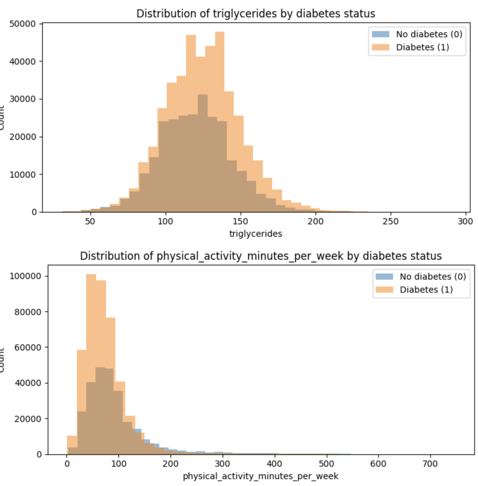
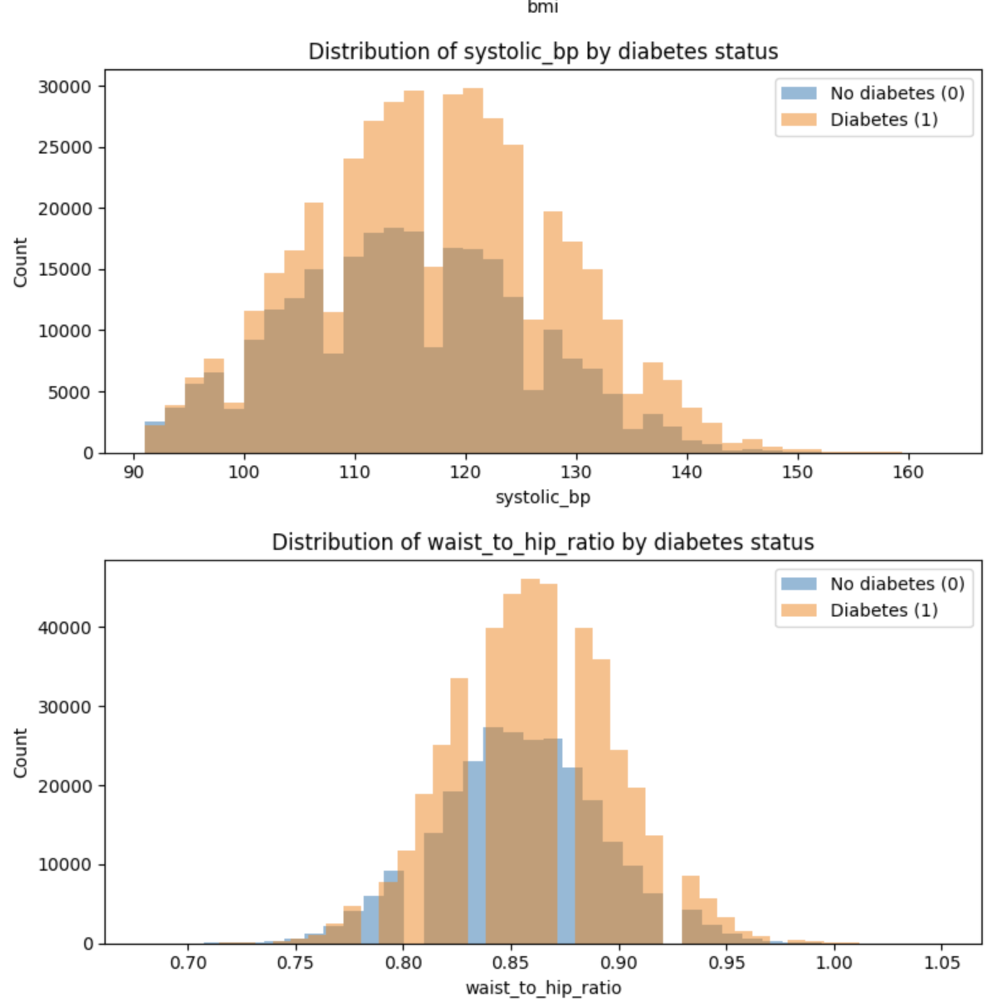
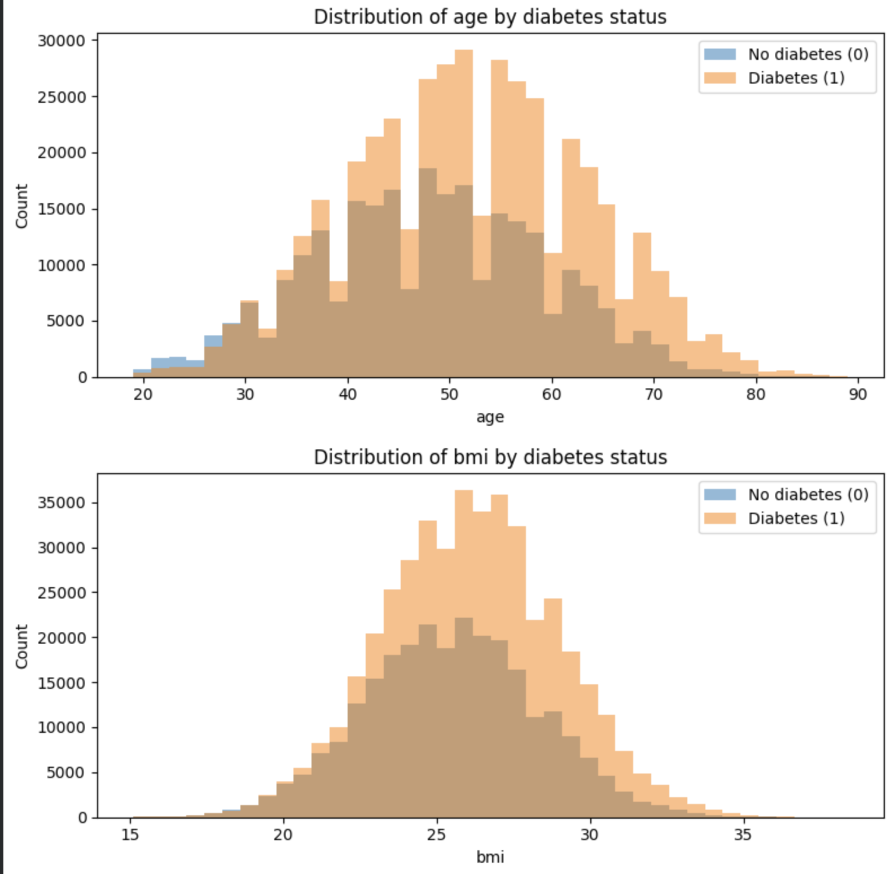

# 📘 Diabetes Prediction — Model Development Journey (3-Stage Progression)

A complete end-to-end evolution from baseline → EDA-driven improvements → advanced engineered final model.

---

## 🧠 Project Overview

This repository documents my complete modelling workflow for predicting **diagnosed diabetes** using structured health, lifestyle, and demographic data.

Across **three iterations**, the model evolves from a simple baseline to a highly engineered, drift-corrected, competition-ready **XGBoost pipeline**.

---

## 🗂️ Project Structure

- diabetespred1.ipynb   Stage 1 – Baseline Model
- diabetespred2.ipynb   Stage 2 – EDA + Drift Handling + Feature Pruning
- diabetespredfinal.ipynb  Stage 3 – Advanced Engineered Final Model
- test and train Data Set   (csv file)
- README.md              (this file)


# 🧭 Modelling Progression — 3 Stages

---

## 🟦 Stage 1 — Baseline Pipeline (Foundation Model)

### 🎯 Goal  
Build a first working model quickly and understand the data shape.

---

### 🔧 Key Steps
- Loaded train/test datasets  
- Basic `.head()`, `.info()`, `.dtypes()` inspection  
- Handled missing values (median/mode)  
- Label-encoded categoricals  
- Scaled numerical features  
- Train/validation split  
- Trained **XGBoostClassifier** with simple hyperparameters  
- Generated submission file  

---

### 💡 What This Version Demonstrated
- Ability to set up a full ML pipeline  
- Understanding of preprocessing basics  
- First reliable benchmark for improvement  

---

### 🧩 Example Code Snippet – Stage 1

```python
from xgboost import XGBClassifier

model = XGBClassifier(
    n_estimators=600,
    max_depth=5,
    learning_rate=0.03,
    subsample=0.8,
    colsample_bytree=0.8,
    random_state=42
)

model.fit(X_train, y_train)
valid_pred = model.predict(X_valid)
```
---


## 📊 Exploratory Feature Distributions (Stage 1 Analysis)

Before modelling, I explored how key numerical features differ between **diabetes (1)** and **non-diabetes (0)** groups.  
These histograms helped identify *high-signal* predictors and motivated feature engineering in later stages.

### ** Distribution 1 **


### ** Distribution 2 **


### ** Distribution 3 **



---

## 🧠 **Key Observations from Feature Distributions**

| Feature                | Observation                 | Effect                                |
|------------------------|------------------------------|----------------------------------------|
| **Triglycerides**      | Much higher for diabetics    | Strong positive predictor              |
| **Waist-to-hip ratio** | Higher among diabetics       | Indicates central obesity risk         |
| **Systolic BP**        | Elevated in diabetics        | Hypertension–diabetes correlation      |
| **BMI**                | Higher for diabetics         | Obesity strongly linked to diabetes    |
| **Age**                | Diabetics tend to be older   | Age is a strong risk factor            |
| **Physical activity**  | Lower among diabetics        | Sedentary lifestyle increases risk     |

---

### 💡 How This Informed Stage 2
These visual patterns revealed:

- Clear **distribution shifts** between classes  
- Strong predictors like triglycerides, BMI, BP, and WHR  
- Need to address **skew**, **drift**, and **non-linear relationships**  
- Motivation for later **feature engineering** (sleep, activity flags, log-transforms)  

This EDA stage helped shape all improvements in Stages 2 and 3.


---
## 🟩 Stage 2 — Exploratory Data Analysis, Drift Detection & Feature Pruning

### 🎯 Goal  
Understand dataset drift, unstable variables, and remove high-noise columns.

---

### 🔧 Key Improvements

- ✔️ Visualized distribution drift between train/test  
- ✔️ Found noisy variables (e.g., high-cardinality categoricals)  
- ✔️ Dropped unstable or redundant features:

```python
['employment_status', 'smoking_status', 'income_level',
 'ethnicity', 'education_level']
```
---

✔️ Fixed class imbalance:
```python
neg, pos = (y == 0).sum(), (y == 1).sum()
scale_pos_weight = neg / pos
```

✔️ Aligned train/test columns perfectly:
```python
train, test = train.align(test, join="left", axis=1, fill_value=0)
```

---

### 💡 What This Version Demonstrated

- Deeper understanding of feature behavior
- Responsible pruning of drift-prone inputs
- Clinical awareness: sensitivity to positive diagnosis cases
- Stronger data hygiene practices

---

### 🧩 Example Snippet – Drift-Based Feature Removal
```python
train.drop(['employment_status','smoking_status',
            'income_level','ethnicity','education_level'], axis=1, inplace=True)

test.drop(['employment_status','smoking_status',
           'income_level','ethnicity','education_level'], axis=1, inplace=True)
```

## 🟥 Stage 3 — Final Advanced Model (Feature Engineering, Drift Corrections, OHE, Robust XGBoost)

### 🎯 Goal  
Build a competition-quality model with engineered features & drift-controlled transformations.

---

## 🔥 Major Upgrades in Final Model

---

### 1️⃣ Drift Correction via Log-Transformations

```python
train[col + "_log"] = np.log1p(train[col])
test[col + "_log"]  = np.log1p(test[col])
```

- ✔️ Stabilizes skew
- ✔️ Reduces train–test distribution gaps
- ✔️ Improves generalization for tree-based models

---
### 2️⃣ Rich Feature Engineering

- Added clinically meaningful binary flags such as:
- Physical activity anomalies
- Sleep-hour thresholds
- Screen-time indicators
- Alcohol consumption bands
- Diet pattern encodings

These capture non-linear health signals that are highly predictive for metabolic disorders.
---
### 3️⃣ Safe One-Hot Encoding + Perfect Alignment
```python
cat_cols = train.select_dtypes(include="object").columns
train = pd.get_dummies(train, columns=cat_cols)
test  = pd.get_dummies(test, columns=cat_cols)

train, test = train.align(test, join="left", axis=1, fill_value=0)
```

- ✔️ Prevents categorical mismatch
- ✔️ Ensures reproducible inference
- ✔️ Avoids test-set leakage
---
### 4️⃣ Dropping Entire Noisy Feature Families (Prefix Strategy)
```python
DROP_PREFIXES = ["income_", "employment_", "ethnicity_", "education_"]
DROP_COLS = [c for c in train.columns if any(c.startswith(p) for p in DROP_PREFIXES)]

train = train.drop(columns=DROP_COLS)
test  = test.drop(columns=DROP_COLS)
```

- ✔️ Removes high-variance sparse dummy columns
- ✔️ Prevents overfitting
- ✔️ Improves model stability
---
### 5️⃣ Robust Validation with ROC-AUC
```python
roc_auc_score(y_valid, valid_proba)
```

ROC-AUC is a superior metric to accuracy for medical classification, where:
- positive cases are rare
- misclassification costs are high
---
### 6️⃣ Final Optimized XGBoost Configuration

```python
final_model = XGBClassifier(
    n_estimators=900,
    max_depth=6,
    learning_rate=0.03,
    subsample=0.85,
    colsample_bytree=0.85,
    reg_lambda=2,
    gamma=0,
    scale_pos_weight=neg/pos,
    random_state=42,
    n_jobs=-1
)
```
- ✔️ Tuned for imbalance
- ✔️ Regularized to prevent overfitting
- ✔️ Designed for strong generalization
- ✔️ Trained on final engineered dataset

---

## 📤 Final Submission (Stage 3)

After training the final engineered XGBoost model on the full dataset, I generated the **probability-based submission** (used for ROC-AUC evaluation).

### ✅ Saved: `submission.csv`  
This file contains:

- `id`
- `diagnosed_diabetes` (predicted probability)

### 📄 Submission Preview

| id      | diagnosed_diabetes |
|---------|---------------------|
| 700000  | 0.404538            |
| 700001  | 0.551726            |
| 700002  | 0.636839            |
| 700003  | 0.343274            |
| 700004  | 0.833294            |

*(Full table available in the notebook output.)*

---

### 🧪 Sanity Check (Probability Range)

```text
Min Probability: 0.034617260098457336  
Max Probability: 0.9824862480163574
```


---


- My final model predicts with probabilities from 0.03 → 0.98, which shows:

- ✔️ Confident high-risk and low-risk predictions
- ✔️ Strong ROC-AUC separation
- ✔️ Correct drift handling + engineered health signals
